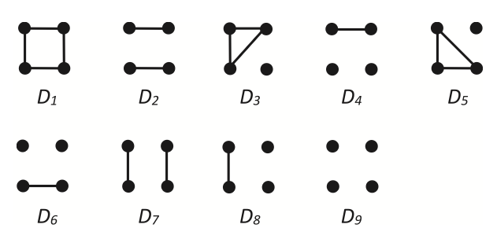
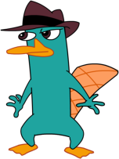

```{r klippy, echo=FALSE, include=TRUE}
klippy::klippy(position="right", color="black")
```

```{r setup, include=FALSE}
library(gbRd)
library(tools)
library("dartR.captive")
library(dartRverse)
library(related)
library(reshape2)
library(data.table)
library(tidyverse)

knitr::opts_chunk$set(echo = FALSE)
pigTest <- readRDS("data/pigTest.rds")
sheepTest <- readRDS("data/sheepTest.rds")


setup_item <- readRDS("data/setup_item.rds")
LSWt111Sim <- readRDS("data/LSWt111.rds")

source("scripts/utils.functions.diagnostics.relatedness.r")
source("scripts/utils.classes.diagnostics.relatedness.r")
source("scripts/infer_paternal_genotypes.R")
source("scripts/gl.diagnostics.relatedness.r")

```

## Calculating Relatedness and the concept of Identical by Descent (IBD)

Session Presenters

------------------------------------------------------------------------

### Learning outcomes

In this session we will learn the basics of calculating relatedness within the dartRverse.

------------------------------------------------------------------------

## Session overview

-   **Introduction to Calculating Relatedness and the concept of IBD**
    -   Brief introduction to the concept of genetic relatedness
    -   What does it mean for individuals to be Identical By Descent and how to calculate an IBD coefficient
    -   Specific methods of calculating relatedness - an overview
-   **Relatedness in dartR**
    -   Calculating relatedness in dartR - what functionality currently exists
    -   Main functions and their use
-   **Adding complexity - use of EMIDB9**
    -   EMIDB9 - brief recap of introduction
    -   How to install EMIBD9
-   **Case Study 1 - Pig breeding dataset**
    -   Introduction to the pig breeding data set
    -   Cleanup and data preparation
    -   Comparison of methods
-   **Case Study 2 - Soay sheep dataset**
    -   Introduction to the Soay sheep dataset
    -   Cleanup and data preparation
    -   Comparison of methods
-   **Inferring an unknown relative - using COLONY**
    -   Intro to COLONY and problem at large
    -   Reading in data and basic cleanup
    -   COLONY run - interpreting output
    -   Matching unknown SNP with individual in population
-   **Additional reading**
    -   References and additional reading
-   **Exercises**
    -   Exercises to work through
    -   Input participants own data

------------------------------------------------------------------------

## Introduction to Genetic relatedness

#### Tutorial introduction

Parentage analysis is highly useful for the estimation of relatedness across a variety of fields including -- conservation, agriculture and human genomics. It provides a succinct and highly accurate way of measuring a variety of forces including sexual selection, effective population size, speciation and natural selection.

The ability to estimate relatedness is a highly useful tool and sees use across a variety of fields, including but not limited to: conservation, agriculture and human genomics. In estimating relatedness, one can succinctly and accurately measure a variety of genetic forces that may be at play within a population, such as: sexual selection, effective population size, speciation and natural selection.

Estimating how related two individuals are is fundamental in ecological restoration, biodiversity conservation and agricultural settings, providing an important metric in the management of breeding programs, small populations, and for providing understanding of mating dynamics, inbreeding and a host of other key parameters.

The basis for the most popular estimators is the concept of identical by descent -- or IBD; in which two alleles are identical if they are copies of the same allele found in a reference population. Relatedness between two individuals is therefore equal to the proportion of alleles shared between them which are IBD. Kinship, which is a similar measure -- is the probability that two alleles, one taken from each individual, are IBD.

------------------------------------------------------------------------

#### Methods of estimating relatedness

Oliehoek et al (2005) summarized contemporary methods as being categorized into 3 distinct groups:

There are a variety of methods for estimating relatedness, however we will focus on 3 distinct methods, as described by Oliehoek et al; those being:

1.  **Those using relationship between additive genetic relatedness -- r, population genetic co-ancestry and molecular co-ancestry.**\
2.  **Those using the relationship between additive genetic relatedness and two gene and four gene coefficients of identity in "non-inbred" populations and consists of Wang (2002) and Lynch and Ritland (1999) and its associated spin offs**\
3.  **Queller and Goodnight**\

However for the purposes of a general introduction we only focus on the first two, with the addition of Jinliang Wang's most recent estimator - EMIBD9.

#### 1. Additive genetic relatedness methods

As described above -- these estimators make use of estimates of coancestry -- or the probability that two alleles drawn at random, one from each individual, -- are IBD. Coancestry and relatedness are expressed relative to a base population -- in which no alleles are IBD, hence the co-ancestry between founders is 0.

These estimators - make use of the molecular similarity index - referring to a single locus in a pair of individuals - defined as the probability that two marker alleles drawn from two individuals are IBD. Alleles that are molecularly identical in the base population are deemed alike in state (AIS).

Problems arise when estimating the allele frequencies for the base population - from which all other estimates are drawn. If the average level of AIS is incorrectly estimated - the resulting estimate will be biased accordingly. If it is underestimated - then the "further back" in time the base population is set - leading to an increase in estimated relatedness.

The inverse is also true - an overestimation of AIS will result in an underestimating of relatedness. An example is setting the base population equal to the current population - resulting in negative estimates for some pairs of individuals.

------------------------------------------------------------------------

#### 2. Additive genetic relatedness and two and four gene coefficients

These estimators consider instead the relationship between relatedness and the two and four gene coefficients of identity in non-inbred populations. Lynch and Ritland developed an estimator based on regression of genotype probabilities of one individual on genotype of the other individual of a pair. Thus these include the probability that at a certain locus - a single allele in individual x is IBD to a single allele in individual y and also the probability that both alleles in individual x are IBD to both alleles in individual y.

------------------------------------------------------------------------

#### 3. EMIBD9

The EMIBD9 estimator differs from those previously mentioned -- given it use of a maximum likelihood method. In particular it uses the estimation of 9 condensed modes of IBD originally described by Albert Jacquard (1972) -- which present the different methods by which 2 individuals at biallelic loci can share IBD alleles. Wang attempts to counteract the bias inherent in the previously mentioned methods - particulary when dealing with inbred populations. In particular he attempts to counter the assumption oft used - of drawing allele frequencies from the same population for which relatedness is attempting to be estimated. Given the assumptions of highly outbred and unrelated populations are frequently violated in such cases - this results in an underestimate of closely related individuals and an overestimate of unrelated/distantly related individuals. To counteract this - Wang proposes the joint estimation of both allele frequencies and dyad probabilities from a sample of genotypes.

Relatedness is an imperfect measure however, and comes with a few key caveats. Being a continuous and relative measure, all estimates depend on the reference population from which the allele frequencies are drawn. As such we can reasonably expect even the most accurate measure to differ considerably from our expected values. In addition, all estimates make broad assumptions about the populations for which relatedness is being inferred. These include, but are not limited to: non-overlapping generations, random mating, little or no migration, gene flow or admixture - or otherwise heavily pronounced "genetic structure".

In addition, multiple studies have failed to come to a consensus with regards to a "superior" estimator between species, populations etc. This would suggest that there is no "ideal" estimator in this regard. Galla et al (2022), found variable performance of estimators across species - and advocated for an "explicit evaluation of multiple estimators for each new data set and system." Similarly, Harrison et al (2013) found that when comparing 3 common methods - there was broad consensus between that "all three could be applied with confidence". In addition, they found accuracy to increase in relation with number of loci and individuals sampled - particulary in highly polymorphic regions, suggesting accuracy may also be a function of sampling depth

As such it becomes evident that parentage is a complex, and highly subjective subject in many regards, with a variety of estimators providing for a wide degree of accuracy and specificity across varying circumstances.

```{=tex}
\begin{center}

\end{center}
```

## Relatedness in action

To illustrate the ways in which different methods for estimating relatedness can differ depending on the dataset being used, we have 2 sample data sets - with completely different compositions.

By estimating the average relatedness in both datasets - we can compare the results of each of our selected estimators - and see how they perform under different conditions. Crucially both of our datasets have attached pedigree's allowing us to benchmark our results and test both the realtive and absolute accuracy of the selected methods.

## Peppa pig gets an SNP panel!

Our first data set is derived from SNP panels conducted on 3534 pigs taken from commercial farms across the United States. In addition to extensive genomic records for a large majority of the population there exists an extensive life history, including age, sex and parentage.

We also know the data set contains a high degree of genetic structure - which is to be expected given its origin. We expect there to exist a high degree of inbreeding, and inter-generational crossing - violating many of the base assumptions of parentage analysis.

#### Data cleanup and imaging

#### Cleanup

We'll start with a simple sweep of the datatset removing those loci with low read count and filtering on depth.

```{r filter-callrate, echo=T, results="hide", warning=F}
pigFilter <- gl.filter.callrate(pigTest, method = "ind", threshold = 0.5)
```

```{r filter-mono, echo=T, results="hide"}
pigFilter<- gl.filter.monomorphs(pigFilter,verbose = 5)
```

```{r filter-call, echo=T, results="hide"}
pigFilter <- gl.filter.callrate(pigFilter,method = "loc", threshold = 0.95,verbose = 5)
```

Having filtered for a variety of metrics such as call rate and monomorphs we will now create a PCOA plot to examine they extent of genetic structure extent within the population

```{r print-PCA}
pigFilter <- readRDS("data/pigFilter.rds")
pigFilterPCA <- readRDS("data/pigFilterPCA.rds")
pigPCAPlot <- gl.pcoa.plot(pigFilterPCA, pigFilter)

```

As seen, there appears to be quite strong genetic structure within the population - with the clear segregation of two populations.

We can now see how our methods compare when it comes to attempting to estimate average relatedness. Luckily for you we've written a handy function for comparing multiple methods at once! Its called gl.diagnostics.relatedness and allows you to run both co-ancestry and EMIBD9 with the same function call.

As such we'll do a gl.diagnostics.relatedness run and see what the output looks like!

```{r diag-One, echo=TRUE}
diagOne <- readRDS("data/diagOne.rds")
diagOne@plotList$Iteration1[[1]]

#gl.diag.pig <-gl.diagnostics.relatedness(pigFilter, 
#                                         cleanup = T, 
#                                         which_tests = "wang", 
#                                         IncludePlots = T, 
#                                         varOut = T, 
#                                         rmseOut = T, 
#                                         runE9 = T,
#                                         e9Path = "data",
#                                         e9parallel = T,
#                                         includedPed = T)
  
```

```{r diag-One_two, echo=TRUE}
diagOne <- readRDS("data/diagOne.rds")
diagOne@plotList$Iteration1[[2]]
```

We can now interrogate our outputs - we'll start by comparing the basic outputs of our estimates.

As we can see certain methods - EMIBD9 and Wang (2002) have a tendency to overestimate the levels of relatedness present - as such its evident that due the aforementioned methods used in calculating relatedness it struggles with genetic structure present in the data set. To compensate we'll separate out the two populations and then perform the analysis separately within each population to see the resulting effects on the estimates.

Returning to the PCA plot, as discussed above we see 2 well-delineated populations. As such we will separate individuals down the middle, either to the left or right of the y axis, being populations A and B respectively.

```{r subset-PCA, echo=T}
groupA <- unique(which(pigFilterPCA$scores[,1] < 0))
groupB <- unique(which(pigFilterPCA$scores[,1] > 0))

groupA <- pigFilter[groupA]
groupB <- pigFilter[groupB]

```

### Group A

```{r groupA_one, echo=TRUE,include=TRUE}
#diagGroupA <- gl.diagnostics.relatedness(groupA,
#                                         cleanup = T, 
#                                         which_tests = "wang", 
#                                         IncludePlots = T, 
#                                         varOut = T, 
#                                         rmseOut = T, 
#                                         runE9 = T,
#                                         e9Path = "data",
#                                         e9parallel = T,
#                                         includedPed = T)
```

```{r groupA, echo=TRUE}
diagGroupA <- readRDS("data/diagGroupA.rds")
diagGroupA@plotList$Iteration1[[1]]
```

```{r groupA_two, echo=TRUE}
diagGroupA@plotList$Iteration1[[2]]
```

### Group B

```{r groupB_one, echo=TRUE,include=TRUE}
#diagGroupB <- gl.diagnostics.relatedness(groupB,
#                                         cleanup = T, 
#                                         which_tests = "wang", 
#                                         IncludePlots = T, 
#                                         varOut = T, 
#                                         rmseOut = T, 
#                                         runE9 = T,
#                                         e9Path = "data",
#                                         e9parallel = T,
#                                         includedPed = T)
```

```{r groupB, echo=TRUE}
diagGroupB <- readRDS("data/diagGroupB.rds")
diagGroupB@plotList$Iteration1[[1]]
```

```{r groupB_two, echo=TRUE}
diagGroupB@plotList$Iteration1[[2]]
```

As we can see by separating out the two populations we improved the resulting fit of the estimates - with EMIBD9 having the most improvement - likely a result of the reduction in genetic structure seen.

## Soay sheep example

The Soay sheep is a breed descended from feral sheep found on the island of Soay off the North coast of Scotland, in the St Kilda Archipelago. A population found on the island of Hirta has, since the 1950's, been subject to an extensive study, serving as a model for the research of evolutionary and population dynamics given its feral and unmanaged state. In the last 20 years with the introduction of micro-satellite, SNP and other complexity reduction methods - the study has taken on a new dimension with the addition of whole genome sequencing - allowing scientists to store whole genomic data for individuals within the population. In addition - there exists a large and comprehensive pedigree - providing a surfeit of data on parentage, sex, age and a variety of other characteristics.

#### Cleanup

We'll start with a simple sweep of the datatset removing those loci with low read count and filtering on depth.

```{r filter-callrate-sheep, echo=T, results="hide", warning=F}
sheepFilter <- gl.filter.callrate(sheepTest, method = "ind", threshold = 0.5)
```

```{r filter-mono-sheep, echo=T, results="hide"}
sheepFilter<- gl.filter.monomorphs(sheepFilter,verbose = 5)
```

```{r filter-call-sheep, echo=T, results="hide"}
sheepFilter <- gl.filter.callrate(sheepFilter,method = "loc", threshold = 0.95,verbose = 5)
```

Having filtered for a variety of metrics such as call rate and monomorphs we will now create a PCOA plot to examine they extent of genetic structure extent within the population

```{r print-PCA-sheep}
sheepFilter <- readRDS("data/sheepFilter.rds")
sheepFilterPCA <- readRDS("data/sheepFilterPCA.rds")
sheepPCAPlot <- gl.pcoa.plot(sheepFilterPCA, sheepFilter)

```

As seen by the PCA there appears to be little if any genetic structure evident within the population - that is there appears to be minimal if any sub-populations present within the group at large. As such we can reasonably expect the assumptions of our related estimates to hold - primarily it being that the population is large, outbred and undergoes random mating.

#### Related analysis

```{r sheepDiag, echo=TRUE}
sheepDiag <- readRDS("data/sheepDiag.rds")
sheepDiag@plotList$Iteration1[[1]]
```

```{r sheepDiag_two, echo=TRUE}
sheepDiag@plotList$Iteration1[[2]]
```

As expected - all methods held up to half-siblings, broadly congruent with the manual coding results - as seen by the red dotted line. There is a high degree of variance present for full-sibs (NOT SURE HAVE TO READ UP AS TO WHY). In addition all methods appear to greatly overestimate the general relatedness of the population evidenced by the plots seen for the half first and second cousins.

## COLONY - relatedness for sibship and parentage.

COLONY is a program developed by Jinliang Wang at the ZSL for the inference of parentage and sibship from multilocus genelogical data. Through the use of a full-pedigree approach - COLONY can more accurately infer relatedness, however at the cost of an increase in computational demands. Samples are assumed to be taken from a large randomly mating population. Individuals are then partioned into three subsamples - offspring, candidate father and candidate mother. Offspring are either full-sibs, half-sibs or unrelated.

### The problem

You have been breeding a small hatch of central bearded Dragons (Pogona Vitticeps), for the purposes of a full genome study. You have a highly fecund female - LSWt111 - who has had a clutch of 24 eggs. The issue arises in that you have no idea who the potential father could be - there are numerous candidate males within the enclosure. As such you need to reconstruct a paternal genotype from the SNP data you have for LSWt111 and her offspring.

### Generating a paternal genotype with COLONY

#### 1. Reading in the data

We'll begin by reading in the RDS data containing the data for LSWt111 and her offspring.

```{r read-rds, echo=T, warning=F}
LSWt111 <- readRDS("data/bella.RData")
LSWt111@other$ind.metrics
```

As expected the dataset contains 25 individuals - which if we investigate the individual metrics section - contains LSWt111 and her 24 offspring - each encoded as Bella_egg\_#. We can now perform some basic filtering as shown previously - focusing on call rate, missingness, sex-linked genes and monomorphs

#### 2. Filtering

##### 1. Call rate

```{r filter-Bella, echo=F, warning=F, results='hide'}
gl.report.callrate(LSWt111, method = "loc")

```

As we can see - callrate across all individuals is 1 - which would suggest there is no need to filter on callrate - even across loci there appears to be a high average callrate.

##### 2. Read depth

```{r reportRdepth-Bella, echo=F, warning=F, results='hide'}
gl.report.rdepth(LSWt111)
```

Read depth is quite low across all individuals - average of approximately "X". As such we will set a range for filtering bewteen 10 and the max read depth of the sample - so as to capture the majority of samples.

```{r filterRdepth-Bella, echo=F, warning=F, results='hide'}
LSWt111 <- gl.filter.rdepth(LSWt111, lower = 15, upper = max(LSWt111$other$loc.metrics$rdepth))
```

##### 3. Minor alleles, secondaries, HWE

```{r filterRest-Bella, echo=T, warning=F, results='hide'}
LSWt111 <- gl.filter.maf(LSWt111,threshold = 3,verbose = 5)
LSWt111 <- gl.filter.secondaries(LSWt111,verbose = 5)
LSWt111 <- gl.filter.hwe(LSWt111,verbose = 5)
```

#### 4. Preparing data

The data must now be prepped for a COLONY run - namely by encoding the metadata file to include 3 columns which encode the parents - ie YES for mother, father or offspring.

```{r, colonyPrep, echo=T}
mother <- rep("no", nrow(LSWt111$other$ind.metrics))
father <- rep("no", nrow(LSWt111$other$ind.metrics))
offspring <- rep("yes", nrow(LSWt111$other$ind.metrics))

LSWt111$other$ind.metrics$mother <- mother
LSWt111$other$ind.metrics$father <- father
LSWt111$other$ind.metrics$offspring <- offspring
LSWt111$other$ind.metrics$mother[25] <- "yes"
LSWt111$other$ind.metrics$offspring[25] <- "no"

tail(LSWt111$other$ind.metrics[,c("id", "mother", "father", "offspring")])

```

We can now run COLONY like so:

```{r, COLONYRUN, echo=T}
paternalinfer <- infer_paternal_genotypes(LSWt111, 
                         mother_id = "LSWt111", 
                         offspring_ids = LSWt111$ind.names[1:24])
```

We can now include the father in the genlight object containing the mother and offspring - like so:

```{r, combineBella, echo=T}
fatherInfer <- as.data.frame(paternalinfer$inferred_father, 
                             row.names = paternalinfer$SNP)
colnames(fatherInfer) <- c("Bella_Father") 
fatherInferGen <- fatherInfer %>%
  {.<- t(.);.} 
bellaRMatrix <- as.matrix(LSWt111)
fatherMat <- as.matrix(fatherInferGen)
combineR <- rbind(bellaRMatrix, fatherMat) %>%
  {. <- as.genlight(.);.}
combineR@other <- LSWt111@other
combineR@pop <- as.factor(rep("A", nInd(combineR)))
combineR <- combineR %>%
  {position(.) <- 1:nLoc(.); .} %>%
  {chromosome(.) <- rep("1", nLoc(.));.}

```

We can now perform a quick PCA to check if the COLONY results are plasuible.

```{r, bellaPCA}
combineR@pop <- as.factor(c(rep("offspring", 24), "mom", "dad"))
bellaPCA <- gl.pcoa(combineR, plot.out = F)
gl.pcoa.plot(bellaPCA, combineR)

```

As expected we see the parents segregate to two separate axis, with the offspring being equidistant from both - as expected in individuals sharing 50% of each parents DNA.

#### 5. Finding the father in the population

Having successfully created an SNP fingerprint for a simulated father within our data set - our goal is now to found said father within the remaining individuals of the population.

We can use the built in dartR method - gl.dist.ind to calculate distances within a population. We can then filter on those individuals having the closest pairwise distance to our potential father.

```{r, gl.dist.ind}
gl.dist.test <- gl.dist.ind(combineR) %>%
  as.matrix()
potential_father <- gl.dist.test[,"Bella_Father"] %>%
  sort()
```

With the lowest score in the group - at 23.47 individual 1 is our most likely candidate for the unknown father. This would also explain his distance value being half that of the other individuals in the population. We can double check these results however by using the gl.grm function. This produces a dendogram - representing the IBS probabilities resulting from crosses of each individual in the population. Given the previous results we would expect Bella_Father and individual 1 to segregate from the rest of the population.

```{r, gl.grm}
#combineDad <- readRDS("data/combineDad.rds")
#gl.grm(combineDad)
```

As expected, we see Bella_father and individual 1 form their own separate branch on the dendrogram. This confirms our previous results and suggests that individual 1 is indeed most likely to be the father of the 24 eggs!

## Exercises

Having now learnt the basics of estimating relatedness you can walk yourself through some exercises, mimicking the skills you learnt above!

### Pedigree reconstruction

{width="20%"}

You have spent the last 6 months in the Murray Darling, studying the platypus! You have been attempting to study the genetic underpinning for its famous bill, which you understand to be an indicator of sexual fitness and general health!

To understand the molecular underpinning for this trait and the method by which it is inherited you have collected samples from 81 individuals, in addition to constructing a pedigree by hand, from known crosses you have observed in the wild. Unfortunately, the pedigree has been lost when you spilt a full glass of coffee on your laptop!

As a result you are now left with just the SNP data from previous samples - from which to construct a pedigree, however you are unsure as to which method is the best. You have faith in the dartR package however and decide to use it to attempt to reconstruct you're lost pedigree!

#### 1.1 Data read in

Let's start with reading in the data! Its stored in the data folder which you can access in the folder for tutorial 15. There is both an .RDS (R-data) and .vcf file. You can read the data in using the base R readRDS function. For an extra challenge you can try to read in the vcf file and convert it to a genlight object.

```{r,readin,exercise=T,eval=T}
# Reading in the RDS file 
platypusSNP <- readRDS("data/platypusSNP.rds")
```

#### 1.2 Data filtering

Next we can do some basic data QC - this should be trivial by now!

```{r,QC,exercise=T,eval=T}
# Do a simple report of basics
gl.report.allna()
gl.report.callrate()
gl.report.monomorphs()
gl.report.rdepth()
gl.report.sexlinked()

# Time to do some filtering
platypusSNP <- gl.filter.allna(platypusSNP)
platypusSNP <- gl.filter.callrate(platypusSNP,
                                  #The rest is up to you
)
platypusSNP <- gl.filter.monomorphs(platypusSNP)
platypusSNP <- gl.filter.rdepth(platypusSNP,
                                #The rest is up to you
                                )
platypusSNP <- gl.filter.sexlinked(platypusSNP,
                                   #The rest is up to you
)

```

#### 1.3 Data QC

Now we can check the composition of our population - just to ensure nothing is awry!

```{r,PCOA,exercise=T,eval=T}
# Start with basic PCOA plot
incaPCOA <- gl.pcoa(platypusSNP,nfactors = 5)
incaPCOAPlot <- gl.pcoa.plot("PCOA",platypusSNP)

```

What do you think? Is it worth separating into groups or analysing as one?

Next we can check the heterozygoity/inbreeding coefficient.

```{r,hetCheck,exercise=T,eval=T}
# Start with basic PCOA plot
gl.report.heterozygosity(platypusSNP,method = "ind")
```

What do you think, is heterozygosity/inbreeding in excess?

#### 1.4 Relatedness run

Time to run gl.diagnostics.relatedness! We've written a skeleton, you fill in what you think each value should be.

```{r,gl_diag_run,exercise=T,eval=TRUE}
# Start with basic PCOA plot
incaTernrelated <- gl.diagnostics.relatedness(platypusSNP, 
                                              cleanup = "T/F", 
                                              which_tests = "wang",
                                              IncludePlots = "T/F",
                                              plotOut = "T/F",
                                              varOut = "T/F",
                                              rmseOut = "T/F", 
                                              runE9 = "T/F", 
                                              e9Path = "data"
)

```

Feel free to look at the output. What do you think is the best method for reconstructing your pedigree?

## References

Hauser, S. S., Galla, S. J., Putnam, A. S., Steeves, T. E., & Latch, E. K. (2022). Comparing genome-based estimates of relatedness for use in pedigree-based conservation management.

Molecular Ecology Resources, 22(7), 2546-2558. <https://doi.org/https://doi.org/10.1111/1755-0998.13630> Jacquard, A. (1972). Genetic Information Given by a Relative. Biometrics, 28(4), 1101-1114. <https://doi.org/10.2307/2528643>

Oliehoek, P. A., Windig, J. J., van Arendonk, J. A. M., & Bijma, P. (2006). Estimating Relatedness Between Individuals in General Populations With a Focus on Their Use in Conservation Programs. Genetics, 173(1), 483-496. <https://doi.org/10.1534/genetics.105.049940>

Wang, J. (2002). An estimator for pairwise relatedness using molecular markers. Genetics, 160(3), 1203-1215. <https://doi.org/10.1093/genetics/160.3.1203>

Wang, J. (2025). EMIBD9: Estimating 9 condensed IBD coefficients, inbreeding and relatedness from marker genotypes. Heredity, 134(3), 155-161. <https://doi.org/10.1038/s41437-024-00739-5>
