```{r klippy, echo=FALSE, include=TRUE}
klippy::klippy(position="right", color="black")
```

```{r setup, include=FALSE}
library(gbRd)
library(tools)
library(semantic.dashboard)
devtools::install_github("https://github.com/green-striped-gecko/dartR.captive/tree/dev_ethan")
library("dartR.captive")
library(dartRverse)
```

## dartR for the developer: Introduction to developing for the dartR package

*Session Presenters*

Ethan Halford and Arthur Georges

## Introduction

### Getting started with development - joining the dartR team

As an open-source project dartR encourages its users to actively contribute to the package, as far as development goes the more the merrier! By helping with development you can improve the quality of the package, limit bugs, and help with the development of new features.

That being said, open source is not a synonym for free for all! To ensure the stability and condition of the package remains high, there are a number of rules we must adhere to when developing new features.

As such in this tutorial, we'll be providing an introduction as to the means by which you can become a developer, and actively contribute to the package. We'll introduce you to the style guide, how to use it in the development of functions, provide a brief intro to github and how to manage pushing, pulling, merging and forking! By the end you'll be a development pro, etc. etc. ...... not done yet

## Session overview

-   **1. Introduction to basics of development**
    -   Starting with basics etc.
    -   Writing functions
-   **2. DartR style guide**
    -   Roxygen2 documentation at start of functions
    -   Good practice for writing functions
    -   Using gl.document for writing start of functions
-   **3. Introduction to github**
    -   Repo's
    -   Push/pull merge etc.
    -   forking directories
-   **4. Example - writing basic function**
    -   gl.something.basic - does ANYTHING
    -   write basic function for printing or combining inputs something like that
-   **5. Github specifically for dartR**
    -   fork directory
    -   create local git repo on rstudio
    -   create function - compile local copy - make sure package is installable - ie changes have broken the package
    -   commit/push to forked repo
    -   make pull/merge request from forked repo to original repo
-   **6. Common errors/hangups**
    -   ie errors with local variables not being defined etc.
-   **7. Roundup/questions etc.**

### 1. Basics of development and the dartR style guide

#### The dartR function: a skeleton

As discussed, there exists a variety of rules which we should adhere to as developers, in doing so we can ensure the quality, stability and uniformity of our work across platforms. We also mustn't forget other developers exist! In all things open source, there are more than one set of eyes, so ensuring easy collaboration is the key to success.

As such we'll begin with the basic structure of a dartR function, its appearance and the logic by which you should write your code. All dartR functions have the following skeleton:

1.  Introductory code based on roxygen2;
2.  Examples again coded in roxygen2;
3.  The initial function definition;
4.  Setting the verbosity level with the help of gl.set.verbosity();
5.  Validating the data passed to the function with the help of gl.check.datatype();
6.  Checking that the required dependencies are in place;
7.  Applying some function specific checks on the values passed to the function;
8.  Announcing the start of the function for the user with the help of utils.flag.start();
9.  DO THE JOB
10. Delivering the graphical outputs
11. Saving the graphical outputs as gglplot and other outputs to the session temporary directory;
12. Adding to the history of the genlight object, for later recall;
13. Announcing the closure of the function for the user;
14. Returning any parameters
15. Closing the function

We'll step through each of these features in more detail to ensure you understand their inclusion.

#### Roxygen2 documentation

Roxygen2 is an R package used in the documentation of functions, primarily for the generation of help() queries, documentation files (.Rd) and the description blurbs etc etc.

INCLUDE PHOTO OF ROXYGEN2 DOCUMENTATION HERE

#### Define the function

The next step is to define the function and its inputs:

INSERT PHOTOT OF DEFINTION

#### Set the verbosity level

Setting the verbosity allows the user to edit the verbosity of the output as required - including things such as function completion, output location, progress bars etc. There are 6 possible paramater values to choose from:

**0 -- silent or fatal errors. Good for batch processing.** **1 -- notifies begin and end, and fatal errors.** **2 -- notifies warnings and progress log, in addition to above.** **3 -- reports progress and results summary, in addition to above.** **4 -- to be implemented.** **5 -- displays a full report.**

This value can either be set when calling the function such as:

INERT IMAGE

Or one can set the global verbosity level using *verbosity \<- gl.set.verbosity(value=n)*.

#### Apply checks of parameters

We now need to apply checks to the input parameters to ensure the user supplied data matches the format specified. We can achieve a simple check with the utils.check.datatype, which checks the main data supplied fits one of the following data types

-   Genlight
-   dist
-   fd
-   matrix

In addition you should apply your own parameter checks of user input. This ensures any errors that arise from incorrect formatting of data is explicitly mentioned as such in the function output. This avoids the outputiting of vague often verbose system errors that may arise instead and may be difficult for the user to debug. We can illustrate this with an example:

INSERT EXAMPLE HERE

```{r badexample}
# random stuff insert - do later 
```

#### Basic flags

Its important to flag the start of the script- to ensure the output displays when the job has commenced. We can do this with the utils.flag.start function:

INSERT EXAMPLE

In addition we also flag the start of the function with a \# DO THE JOB tag: such as:

```{r badexample_2}
thingy <- function(a,b){
  
  if(!(a == "num" | b == "num")){
    stop("a and b wrong format")
  }

  # DO THE JOB
  
  output <- a + b
  return(output)

}
```

#### Display output

Come back to it

#### Finish up

Come back to it

### Have some style! Programming with style

As a flexible programming language, R allows for a diversity of methods when tackling a problem. Consider the inclusion of packages designed to improve flow and structure and this effect is amplified even more so! As such it its important you write code not only for yourself but for those with whom you're working.

As such perhaps the most important rule in this regard is to COMMENT!!!! By generously commenting your code (even where it may seem unnecessary), you lend your code a degree of readability that transcends the actual program itself. Even the most dense code can become more readable if commented correctly and it allows both yourself and other programmers to pick it up quickly and continue where you left off.

In addition it is important to properly indent and space your code. Given that R is lazily compiled, that is to say compiled line by line, it lacks the strict indentation required of other, compiled languages, such as C, C++ or Fortran.

For more info on what constitutes good, readable, efficient code - Hadley Wickham has written a comprehensive tome on the subject - Advanced R, for which there is a thorough treatment of style - http://adv-r.had.co.nz/Style.html. 


### 2. Introduction to Github 
    -   Repo's
    -   Push/pull merge etc.
    -   forking directories


As I'm sure many of you are aware - dartR's code is hosted on github - an opensource development platform for version management and control. This includes all of the base dependencies - such as dartR.base and dartRverse in addition to the expansion modules and experimental functions/versions being actively developed. 

The manner in which this code is governed by a set of strict protocols (as mentioned above) - designed to protect the stability of the packages and ensure they're (relatively) bug free. This can be summarised as below: 

INSERT IMAGE OF DARTR WORKFLOW 


#### Repo's 
A repo or repository consists of the base from which all code is hosted. It contains a projects files, code and a history of the revisions done to said code. In addition is hosts branches - or copies of the original main branch - from which developers can work in isolation from the original code and edit at will. 


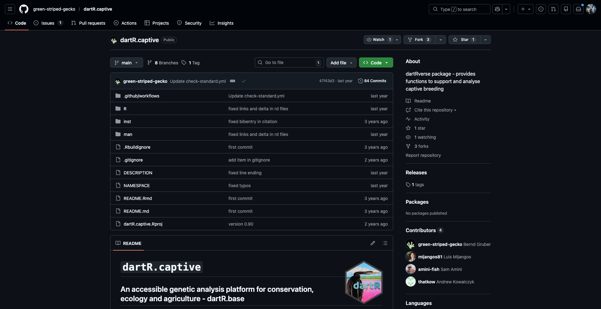{width=100%}


As seen in the images below - the dartR.captive repo hosts a number of branches - each hosted by its respective developer. As such none of these developers directly edit the code present on the main branch - so as to avoid conflicts. 


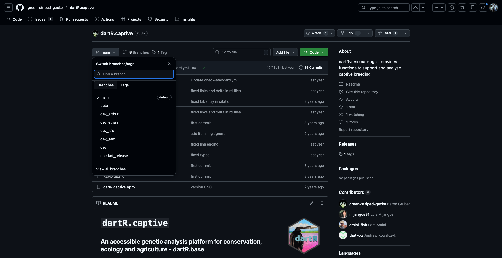{width=100%}


Clearly there is the potential for the local and remote branches established by individual developers to diverge from the work that has been contributed by others. To avoid working on stale branches, developers should follow the below procedure:
  1.	Pull the latest working version of dartR from the remote origin/dev to your local branch (e.g. dev_jacob).
  2.	Resolve any conflicts (hopefully few if you do all of this regularly).
  3.	Add new scripts or alter existing scripts, do a local build, and test the scripts function appropriately without error.
  4.	Commit any changes you have made to scripts, and include any files created by the local build.
  5.	Push your local branch (e.g. dev_jacob)to your remote branch (e.g. origin/dev_jacob)where it is then available to the Core dartR Team to evaluate your changes committed in 1 above, and ultimately merge with dev.


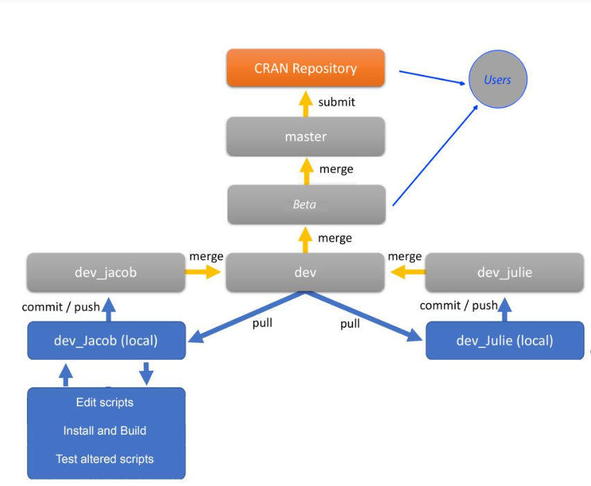{width=100%}


#### Forking a directory 
As an alternate - you can also fork a directory and then push any changes made - without requiring developer access to the repo. This may be the best alternative if proposing a small change or if not expecting to make repeated changes to the package (ie you might only include some level of functionality YOU require). 


To begin you simply press the fork button at the top of the repo home page: 

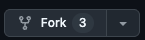{width=100%}

This will then take you a page where you can specify how you'd like to fork the original page. 

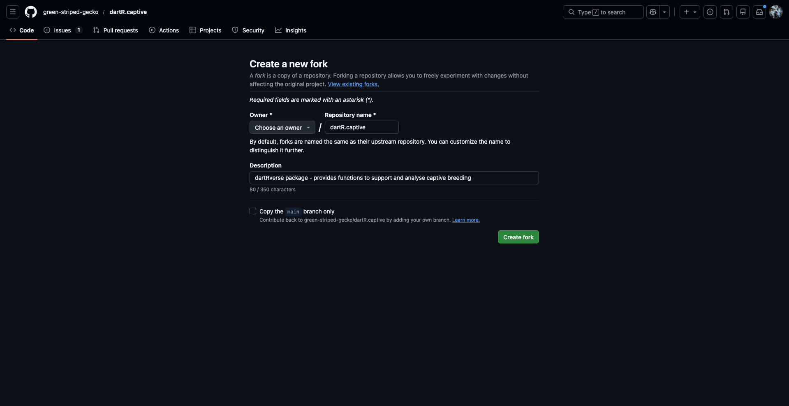{width=100%}


### 3. Example function - gl.does.something
Having introduced you to the basic of writing functions for dartR and github we'll now go through the process of writing our own function and then pushing it to a fork. 


#### gl.document 
```{r gl.tingbrev}
#' @name gl.document
#' @title Generate a roxygen2 Documentation Template for a Function
#' @description
#' Creates a skeleton \code{roxygen2} documentation file for a specified 
#' function. The generated file contains standard documentation fields 
#' including title, description, parameters, details, return value, examples, 
#' and references. The output is written as a new \code{.R} file in the 
#' specified directory.
#'
#' The function inspects the formal arguments of the target function and 
#' automatically generates \code{@param} entries for each argument. This 
#' provides a structured starting point for developing consistent 
#' documentation across a package.
#'
#' @param func_name Name of the function to be documented (unquoted).
#' @param author_name Character string specifying the author of the function.
#' @param example_dataset Name of an example dataset to include in the 
#' documentation examples (currently placeholder, not implemented).
#' @param outputDir Character string specifying the directory where the 
#' documentation file will be written. The file will be named 
#' \code{<func_name>.R}.
#'
#' @details 
#' The function constructs a list of standard documentation fields and writes 
#' them in roxygen2 format to a new file connection. Parameter names are 
#' extracted using \code{formals()} and written as placeholder entries for 
#' subsequent manual editing.
#' 
#' The generated template includes the following sections:
#' \itemize{
#'   \item \code{@name}
#'   \item \code{@title}
#'   \item \code{@description}
#'   \item \code{@param}
#'   \item \code{@details}
#'   \item \code{@return}
#'   \item \code{@author}
#'   \item \code{@examples}
#'   \item \code{@references}
#' }
#'
#' @return 
#' A new \code{.R} file containing a roxygen2 documentation template is 
#' written to the specified directory. The function returns \code{NULL} 
#' invisibly.
#'
#' @author 
#' Author name supplied via \code{author_name}.
#'
#' @examples
#' # Example usage:
#' # gl.document(
#' #   func_name = myFunction,
#' #   author_name = "Your Name",
#' #   example_dataset = "gl.example",
#' #   outputDir = "R/"
#' # )
#'
#'
#' @export

gl.document <- function(func_name, 
                        author_name,
                        example_dataset = NULL,
                        outputDir){
  
  # Convert function to character name
  funcName <- as.character(substitute(func_name))
  
  # Extract parameter names
  parameters <- names(formals(func_name))
  
  # ---- Construct example call ----
  example_call <- paste0(funcName, "(", 
                         paste(parameters, collapse = ", "),
                         ")")
  
  # Build example block
  example_lines <- c(
    "#' @examples",
    "#' # Example usage:",
    if(!is.null(example_dataset)) 
      paste0("#' data(", example_dataset, ")"),
    paste0("#' ", example_call)
  )
  
  # Remove NULL if no dataset
  example_lines <- example_lines[!is.na(example_lines)]
  
  # ---- Create file connection ----
  fileConn <- file(paste0(outputDir, funcName, ".R"), "wt")
  
  # ---- Write header fields ----
  writeLines(paste0("#' @name ", funcName), fileConn)
  writeLines(paste0("#' @title Title for ", funcName), fileConn)
  writeLines(paste0("#' @description ", funcName, " does:"), fileConn)
  writeLines("#'", fileConn)
  
  # ---- Write parameters ----
  for(params in parameters){
    writeLines(paste0("#' @param ", params, " Insert description."), fileConn)
  }
  
  writeLines("#'", fileConn)
  
  # ---- Write details ----
  writeLines(paste0("#' @details"), fileConn)
  writeLines("#' Detailed description goes here.", fileConn)
  writeLines("#'", fileConn)
  
  # ---- Write return ----
  writeLines(paste0("#' @return ", funcName, " returns:"), fileConn)
  writeLines("#'", fileConn)
  
  # ---- Write author ----
  writeLines(paste0("#' @author ", author_name), fileConn)
  writeLines("#'", fileConn)
  
  # ---- Write examples ----
  writeLines(example_lines, fileConn)
  writeLines("#'", fileConn)
  
  # ---- Write references ----
  writeLines("#' @references", fileConn)
  writeLines("#' Patterson, J. (2005). Maximum ride. New York: Little, Brown.", fileConn)
  writeLines("#'", fileConn)
  
  writeLines("#' @export", fileConn)
  
  close(fileConn)
  
  invisible(NULL)
}
```


The function gl.document writes basic document for creating new R functions such that the user can then fill in the rest with ease. We'll be pushing our changes to a fork of the dartR.base package. 


#### Forking 
I've already create a fork of dartR.base called dartR.base_testing with which to illustrate this example - this was done in a manner identical to how it was explained above. 

We will now pull this fork into a new R repo - test if the function works within the confines of the package and then push our changes pack to the repo. 

#### Setting up the R project 
We'll start by creating a new R project under version control. Go to 'New Project' then version control, then git - upon which you should get a screen like below: 


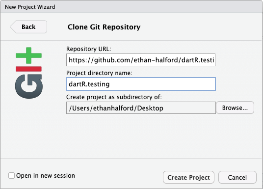{width=100%}


Then name the cloned repo and insert the repository URL for the github repo you'd like to clone. We can now create a new fork for working in. Go to the git tab and click 'New branch' upon which you'll be greeted with the following screen: 

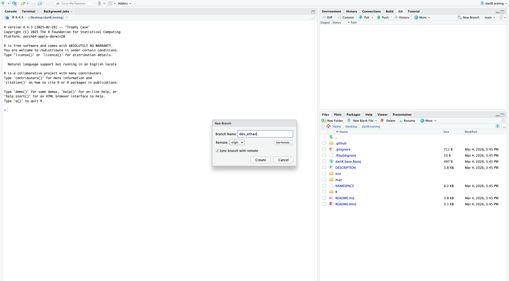{width=100%}

This will then pull the contents of the R repo with a screen such as: 

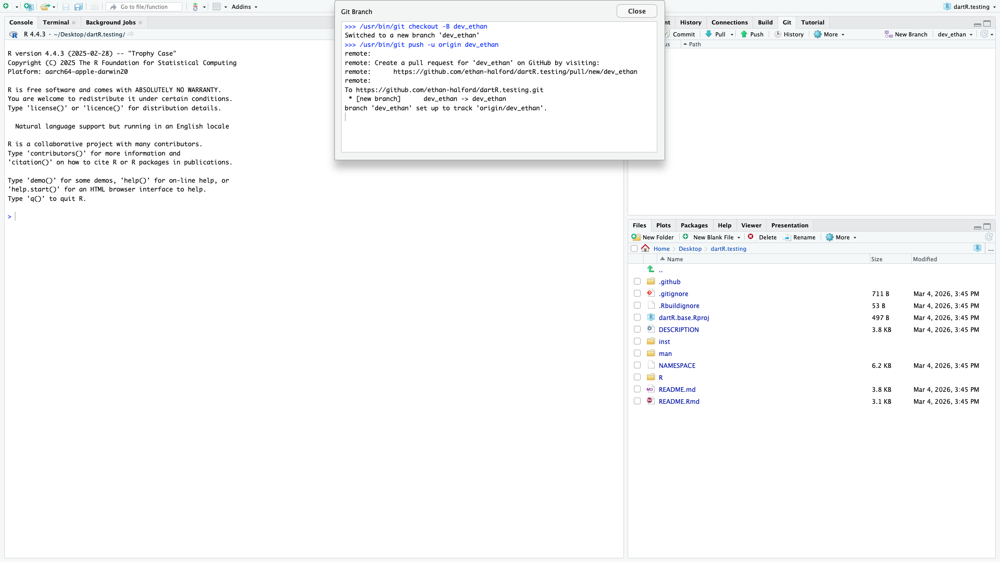{width=100%}


After creating a new R file we can then paste in the contents of our R function - with a useful name - in this case gl.document.R. We can then attempt to install the package to test it can built from scratch without error: 

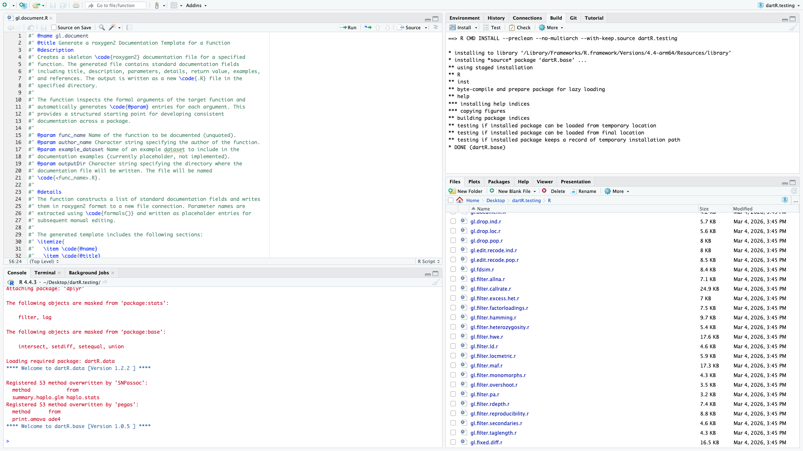{width=100%}

Given it was successful we can now push our changes to the original repo - which upon being successful we should get the following message: 

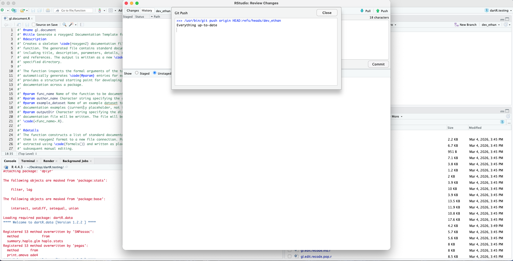{width=100%}


We can now attempt to merge our dev branches to the regular dev_branch. 


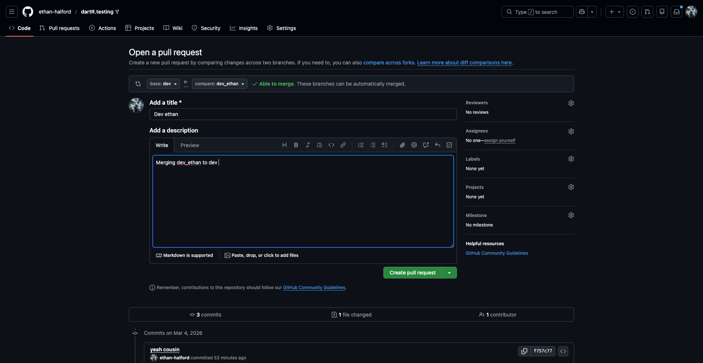{width=100%}

Having completed the pull request we can see if the branches can be merged successfully. 


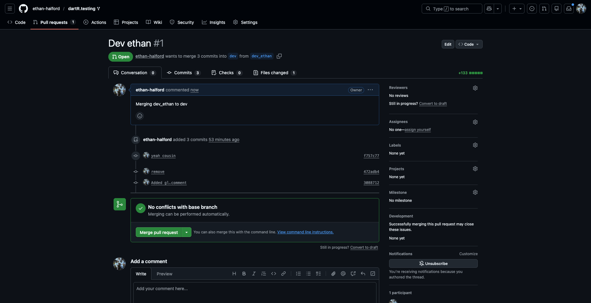{width=100%}

As we can see the branches can be merged without trouble - so we can go ahead and approve the merged request. 


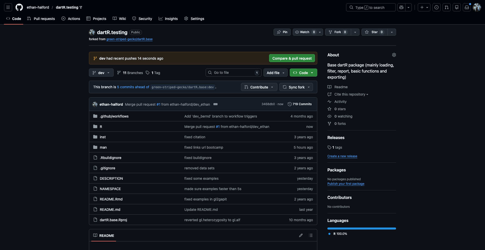{width=100%}


Looking at the dev page of our fork we can now see the dev branch has had a recent push (as expected) with our description in the R folder. As such our push was successful and our changes have been added to the repository. 


## Exercise 
Having now learned how to fork, push and pull to repositories - we can now practice our new developer skills! If you'd like you can fork my fork of the dartR.captive repo - dartR.testing and attempt to push your own changes to the dev branch. I will then go through these attempted pushes and accept them thus adding them to the dev branch of dartR.testing!


